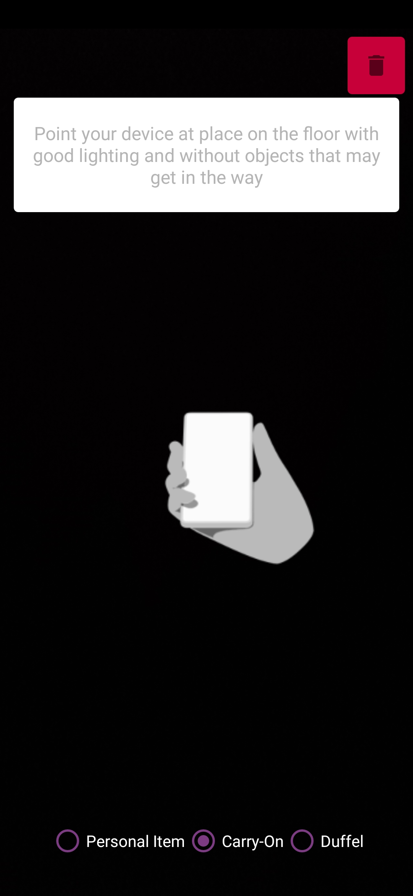
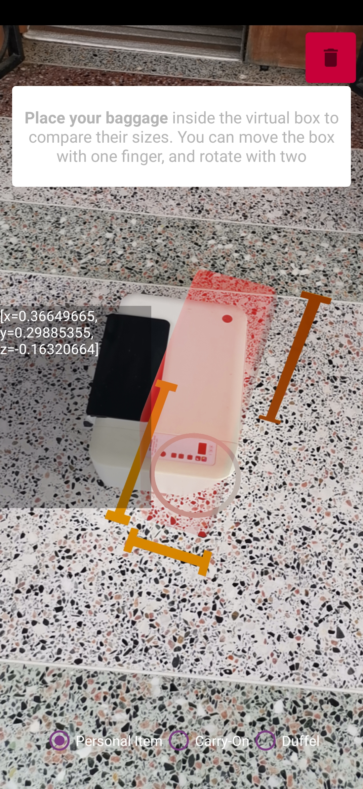
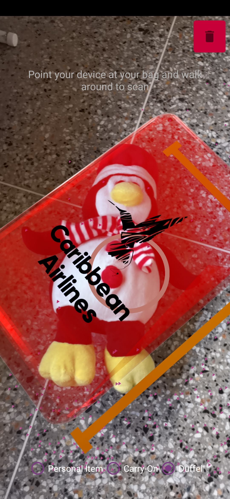
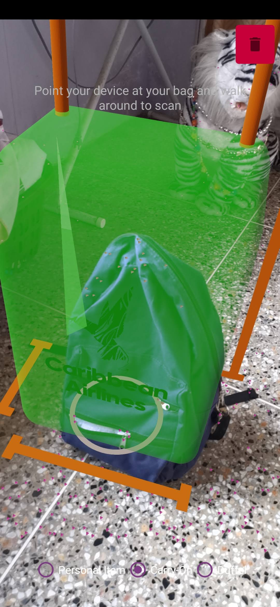

# react-native-baggage-module

This module was built for Caribbean Airlines Limited to allow passengers to measure carry-on items at home using an Android device.

## Getting started

### Installation

`$ npm install /BaggageModule --save`

### Usage

#### Android

1. Open up `App.js` file
2. Add `let ARModule = NativeModules.RNBaggageModule' after import section
3. Implement React Native function launch() with two parameters:
   Callback errorCallback
   Callback successCallback
4. Call launch() via async function to launch the AR Native activity

## Sample Results
### Application Interface
<table style="border: none;">
  <tr>
    <td></td>
    <td>Shown is the library's application interface. A Radiogroup allows users to choose their type of bag</td>
  </tr>
</table>

### Output

The following shows application results when measuring different types of objects
<table style="border: none;">
  <tr>
    <td style="border: none;"></td>
    <td style="border: none;"></td>
    <td style="border: none;"></td>
  <tr>
</table>

## Scalability

This application can scale to use many sizes of objects. Testing has not been carried out to determine the limits of sizes at which accuracy falls off. Additionally, modification to the library code may allow arbitrary measurement
